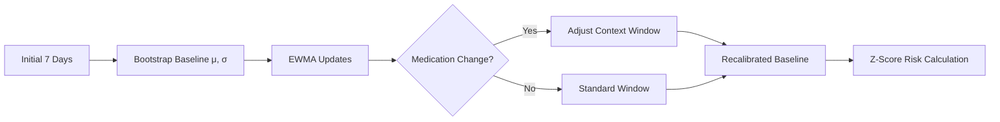
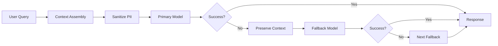
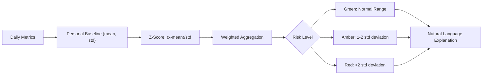

# Bipolar Guardian

## New to Digital Health Projects?

If terms like "EWMA," "multi-model orchestration," or "digital phenotyping" feel unfamiliar, that's completely normal! This project sits at the intersection of mental health, technology, and data science.

**[Start here for a friendly introduction](docs/USER_GUIDE.md)** that explains the "why" and "what" behind this work in everyday language.

Already comfortable with technical concepts? Continue reading below.

## Technical Architecture

### Personal Baseline Evolution



The system uses exponentially weighted moving averages with context-aware windowing. When medication changes are detected, it temporarily shortens the effective window to emphasize post-change data while preserving historical context.

### Multi-Model Orchestration



State-preserving fallback maintains therapeutic context across model failures. When the primary model is unavailable, the system automatically switches while retaining the full conversation history and sanitized health context.

### Risk Scoring Pipeline



## Core Capabilities

### Adaptive Personalization
- **Dynamic baselines** that evolve with life changes
- **Medication-aware windowing** for accurate post-change recalibration  
- **Individual normal ranges** rather than population averages
- **Transparent Z-score calculations** with natural language explanations

### Resilient AI Integration
- **Multi-model portfolio** with automatic failover
- **Context preservation** across model switches
- **PII-minimized prompts** with sanitized health context
- **Therapeutic boundaries** with crisis resource routing

### Embedded Validation
- **Testing harness** integrated into production
- **Real-time quality assurance** during development
- **Medical terminology validation** via edge functions
- **Therapeutic response evaluation** against safety rubrics

## Getting Started

### Prerequisites
- Node.js 18+ 
- A [Supabase](https://supabase.com) account (free tier works)
- OpenRouter API key for AI models

### Quick Setup
```bash
git clone https://github.com/bxrdy/bipolar-guardian
cd bipolar-guardian
npm install
```

### Supabase Configuration

1. **Create a new Supabase project** at [database.new](https://database.new)

2. **Set up your environment variables** - Create `.env.local`:
```env
VITE_SUPABASE_URL=your_supabase_project_url
VITE_SUPABASE_ANON_KEY=your_supabase_anon_key
```

3. **Run database migrations** to set up the schema:
```bash
npx supabase link --project-ref your-project-ref
npx supabase db push
```

4. **Deploy edge functions** for AI processing:
```bash
npx supabase functions deploy
```

5. **Configure OpenRouter API key** in your Supabase project's Edge Function secrets:
```bash
npx supabase secrets set OPENROUTER_API_KEY=your_openrouter_key
```

6. **Create a test account** - Use your own email/password (no hardcoded test credentials)

7. **Start the development server**:
```bash
npm run dev
```

### Testing & Validation
Navigate to `/testing` for the comprehensive validation framework. See [complete setup guide](docs/developer/SETUP.md) for detailed testing information.

## System Architecture

### Technology Stack
- **Frontend:** React 18, TypeScript, Tailwind CSS, shadcn/ui
- **Backend:** Supabase (PostgreSQL, Auth, Edge Functions)  
- **AI Models:** Multi-provider orchestration via OpenRouter
- **Mobile:** Capacitor for iOS/Android, PWA capabilities
- **Security:** Enterprise-grade security with Row-Level Security, PII sanitization, encrypted storage, audit trails, and session hardening
